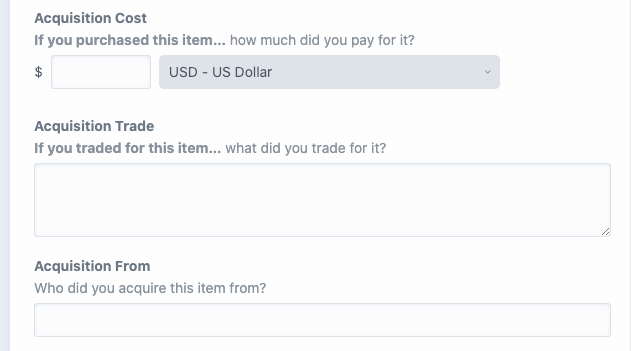

# Money plugin for Craft CMS 3.x




## Requirements

This plugin requires Craft CMS 3.5.0 or later.

## Installation

To install the plugin, follow these instructions.

1. Open your terminal and go to your Craft project:

```console
$ cd /path/to/project
```

2. Then tell Composer to load the plugin:

```console
$ composer require newism/craft3-money
```

3. In the Control Panel, go to Settings → Plugins and click the “Install” button for Money or run

```console
$ ./craft plugin/install money
```

## Money Overview

Money is a custom field type and formatter that uses the [moneyphp/money](https://github.com/moneyphp/money) library. Values are stored as json in the database and normalized as a [Money](https://github.com/moneyphp/money/blob/master/src/Money.php) Value Object.

Currencies are loaded from the [moneyphp/money](https://github.com/moneyphp/money) library. A full list can be found here: https://github.com/moneyphp/money/blob/master/resources/currency.php

This plugin also loads in `symfony/intl` for currency names.

## Configuring Money

Money has two levels of configuration:

* Site settings using a config file or plugin settings
* Field settings

*Note: Field settings are appended to Site settings.*

The two settings are:

* Preferred currencies: These currencies are displayed first in the currency drop down.
* Excluded currencies: These currencies are excluded from the currency drop down.

Both settings accept a comma delimited list of alphabetical currency codes.

It's recommended that you exclude the following currencies: `XBA, XBB, XBC, XBD, XTS, XXX, XAU, XPD, XPT, XAG`

To use a config file see [./src/config.php](./src/config.php).

## Using Money

This plugin includes a service for rendering the field value.

Note: In the three methods below `value` must be an instance of `Money`. The examples use the ['Elvis Operator'](https://twig.symfony.com/doc/3.x/templates.html#other-operators).

### International formatter

    {{ value ? craft.money.intlFormatter.format(value) }}

    # or explicitly define the locale
    {{ value ? craft.money.getIntlFormatter(locale).format(value) }}

The `intlFormatter` returns a `[IntlMoneyFormatter](http://moneyphp.org/en/stable/features/formatting.html#intl-money-formatter)` object. This formatter requires the intl extension.

Calling `.format()` will return a string with the currency symbol in a format that matches `locale`. Separators will also match the locale.

`locale` is an optional parameter and falls back to the locale defined by Craft: `\Craft::$app->locale->id`

See: http://moneyphp.org/en/stable/features/formatting.html#intl-money-formatter

### International Decimal Formatter

    {{ value ? craft.money.intlDecimalFormatter.format(value) }}

    # or explicitly define the locale
    {{ value ? craft.money.getIntlDecimalFormatter(locale).format(value) }}
    
Outputs the same as above without the currency symbol.

See: http://moneyphp.org/en/stable/features/formatting.html#intl-decimal-formatter
    
### Decimal Formatter

    {{ value ? craft.money.decimalFormatter.format(value) }}
    
This formatter outputs a simple decimal string which is always in a consistent format independent of locale.

## Money Roadmap

Some things to do, and ideas for potential features:

* Test multiple versions of PHP
* Review the usage of `symfony/intl` for currency names
* Write tests
* Check GraphQL output
* Add localised strings for plugin ui
* Release it

## Credits

Brought to you by [Newism](http://newism.com.au)

[](http://newism.com.au/)
